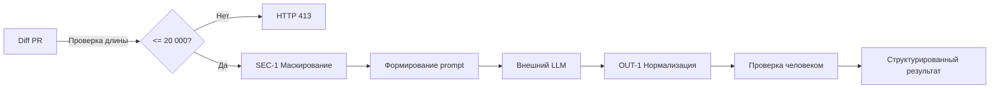

# ADR: решение для первого рабочего сценария

- Статус: proposed
- Дата: 2026-09-09
- Ответственные: учебная команда (роли не персонализированы)

## Контекст

Учебный сервис AI‑помощника ревьюера принимает diff PR и возвращает результат анализа. В текущем diff (TRAINING_PR.diff) реализованы метод `ReviewService.review` и эндпоинт `POST /api/reviews`, которые пересылают diff во внешний LLM и возвращают произвольный текст в поле `comment`. Правила кейса (CASE.md) требуют:
- SEC-1: маскировать секреты перед вызовом внешнего LLM;
- API-1: отклонять diff длиной > 20 000 символов с HTTP 413;
- OUT-1: возвращать структуру `summary`, `risks` (<=3, с `file`,`line`,`evidence`,`risk`), `checks`;
- SCOPE-1: сервис только советует, не выполняет действия в GitHub;
- QA-1: включать риск только при подтверждении строкой diff или правилом.

## Решение

Принять минимальный дизайн, обеспечивающий соблюдение правил без расширения зоны ответственности:
- На входе API проверять длину diff и возвращать HTTP 413 при превышении (API-1).
- Перед вызовом LLM пропускать diff через маскирование секретов (SEC-1).
- После ответа LLM выполнять постобработку/нормализацию к формату OUT-1 (ограничить `risks` до 3, потребовать evidence и file:line).
- Сохранять запреты SCOPE-1: никаких действий в GitHub; решение остаётся за человеком.
- Включать в результат только подтверждённые риски (QA-1): требовать цитату из diff или ссылку на правило.

## Рассмотренные альтернативы

| Альтернатива | Почему не выбрали сейчас |
|---|---|
| Отправлять сырой diff без маскирования | Нарушает SEC-1 и создаёт риск утечки секретов |
| Увеличить лимит > 20 000 символов | Необоснованно; правило API-1 явно фиксирует порог |
| Возвращать свободный текст | Невоспроизводимо и нарушает OUT-1, сложнее автоматизировать проверки |
| Добавить ретраи/таймауты/логирование | Не подтверждено материалами; вне объёма учебного сценария |

## Последствия и главный риск

- Положительные последствия:
  - Структурированный и проверяемый ответ, снижение риска утечек, предсказуемое поведение API на больших входах.
- Ограничения:
  - Возможные ложноположительные/ложноотрицательные срабатывания маскирования; жёсткий лимит размера diff может требовать разбиения.
- Главный риск:
  - Маскирование может скрыть важное evidence и ухудшить качество ревью.
- Как проверим риск:
  - Интеграционный тест с диффом, содержащим тестовые секреты, и проверкой, что [REDACTED] не препятствует подтверждению рисков (QA-1).

## Архитектурная схема

## Как использовали AI

- Для чего:
  - Сформулировать минимальное архитектурное решение под правила кейса, без выдумывания ненужных деталей.
- Тип промпта:
  - planning/master prompting.
- Строка в [`prompts.md`](prompts.md):
  - P1-03 (Заполнение SDLC).
- Что проверили и исправили сами:
  - Синхронизировали с context.md/problem.md; исключили неподтверждённые требования (ретраи/таймауты); оставили только SEC-1, API-1, OUT-1, SCOPE-1, QA-1.
