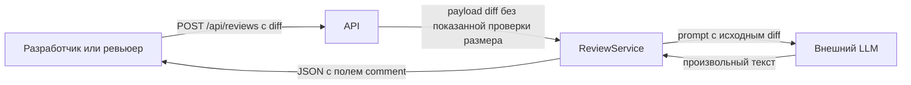
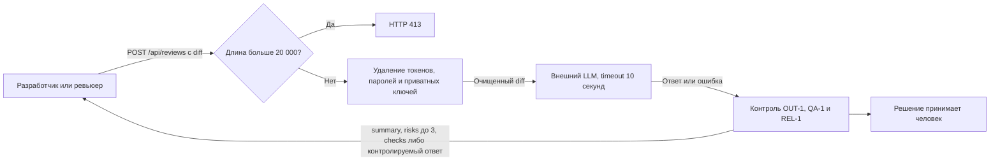

# Анализ процесса: AS IS и TO BE

## AS IS

1. Разработчик или ревьюер отправляет diff в `POST /api/reviews`.
2. API без показанной проверки размера передаёт `payload["diff"]` в `ReviewService.review`.
3. ReviewService включает исходный diff в prompt и вызывает внешний LLM без показанного удаления секретов и timeout.
4. Ответ LLM возвращается клиенту как `{"comment": answer}`.

Наблюдаемые разрывы относительно `CASE.md`: нет показанной реализации SEC-1 и API-1; формат ответа не соответствует OUT-1. Реализация REL-1 и OBS-1 в учебном diff также не показана. Решение о принятии рекомендаций остаётся за человеком по SCOPE-1.

## TO BE

Выбран DFD-подобный поток в Mermaid: он показывает границы доверия и преобразования данных, рендерится в GitHub и не требует неподтверждённых ролей или инфраструктуры.

Ограничения модели процесса:

- точные код и схема контролируемого ответа REL-1 неизвестны;
- точка реализации логирования OBS-1 в `TRAINING_PR.diff` не показана;
- конкретный алгоритм удаления секретов и формат ответа внешнего LLM не заданы;
- никаких действий записи кода, approve или merge процесс не выполняет.

## Разница

| Что меняется | AS IS | TO BE | Как проверим изменение |
|---|---|---|---|
| Размер входа | Diff сразу передаётся в сервис | Значения 19 999 и 20 000 допускаются, 20 001 отклоняется с HTTP 413 | Три граничных API-сценария по API-1 |
| Секреты | Исходный diff входит в prompt | Токены, пароли и приватные ключи удаляются до внешнего LLM | Spy на границе LLM и три тестовых секрета по SEC-1 |
| Надёжность внешнего вызова | Timeout и обработка ошибки не показаны | Вызов ограничен 10 секундами, ошибка превращается в контролируемый ответ | Медленный и ошибочный LLM-test-double по REL-1 |
| Формат результата | `{"comment": answer}` | `summary`, `risks`, `checks`; не более трёх доказательных рисков | Контрактная проверка OUT-1 и отрицательный сценарий QA-1 |
| Граница полномочий | Код показывает только возврат ответа | Совет передаётся человеку без записи кода, approve и merge | Наблюдение внешних зависимостей по SCOPE-1 |
| Журналирование | В diff не показано | Только `request_id`, длительность и статус; без diff и ответа модели | Проверка уникальных маркеров по OBS-1; точку наблюдения должен подтвердить человек |

## Как использовали AI

- Для чего:
  - Сравнить три допустимых способа описания процесса и заполнить пустой анализ проверяемой моделью AS IS / TO BE.
- Тип промпта:
  - Tree of Thoughts с внешне описанными альтернативами и критериями выбора.
- Строка в [`../practice_02/prompts.md`](../practice_02/prompts.md):
  - Tree of Thoughts.
- Что проверили и исправили сами:
  - Сверили AS IS с `TRAINING_PR.diff`, TO BE — с правилами SEC-1, API-1, REL-1, OUT-1, SCOPE-1, QA-1 и OBS-1; неизвестные не выдавали за реализованные компоненты.
