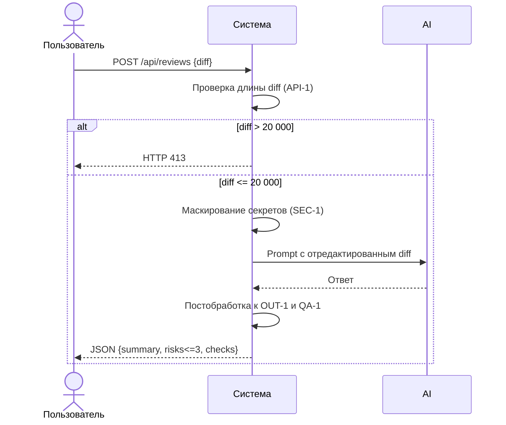

# Use cases и user stories

## Первый рабочий сценарий

Когда разработчик отправляет POST /api/reviews с diff учебного PR, система валидирует размер diff (API-1), маскирует секреты перед вызовом внешнего LLM (SEC-1), формирует ответ в формате OUT-1 и возвращает его. Пользователь получает краткое summary, не более трёх подтверждённых рисков с file:line и evidence, а также список проверок.

Не входит в этот сценарий:

- approve/merge PR, изменение исходного кода и любые действия в GitHub (SCOPE-1);
- ретраи/таймауты/логирование, если они не отражены в предоставленных материалах (неизвестно);
- интеграция с внешними системами кроме внешнего LLM (в рамках кейса не описано).

## Use case

| Поле | Значение |
|---|---|
| Актор | Разработчик/ревьюер (внутренний пользователь) |
| Триггер | HTTP POST /api/reviews с телом `{ "diff": "..." }` |
| Предусловия | Доступен API сервиса, diff не превышает 20 000 символов |
| Основной результат | Ответ соответствует OUT-1: summary, risks<=3 с file,line,evidence,risk, checks[] |
| Ошибка или отказ | Если diff > 20 000 — HTTP 413; если вход некорректен — контролируемая ошибка; действий в GitHub нет |



## User stories и acceptance criteria

```gherkin
Feature: Автоматическое ревью учебного PR по diff

  Scenario: Позитивный ответ в формате OUT-1
    Given доступен API POST /api/reviews
      And diff длиной <= 20000 символов без реальных секретов
    When я отправляю запрос с корректным diff
    Then я получаю JSON с полями summary, risks, checks
      And в risks не более 3 элементов, каждый с file, line, evidence, risk
      And каждый риск подтверждён строкой из diff или правилом (QA-1)

  Scenario: Негативный — превышение размера входа
    Given доступен API POST /api/reviews
      And diff длиной > 20000 символов
    When я отправляю запрос с таким diff
    Then я получаю HTTP 413

  Scenario: Граничный — маскирование секретов
    Given доступен API POST /api/reviews
      And diff содержит тестовый token в явном виде
    When сервис формирует prompt для LLM
    Then в prompt вместо токена содержится [REDACTED]
```

## Как использовали AI

- Для чего:
  - Формулировка первого рабочего сценария, use case и acceptance criteria, согласованных с правилами из CASE.md и контекстом.
- Тип промпта:
  - planning/master prompting.
- Строка в [`prompts.md`](prompts.md):
  - P1-03 (Заполнение SDLC).
- Что проверили и исправили сами:
  - Исключили действия вне SCOPE-1, не придумывали неупомянутые интеграции; проверили, что все критерии ссылаются на QA-1, SEC-1, API-1, OUT-1.
