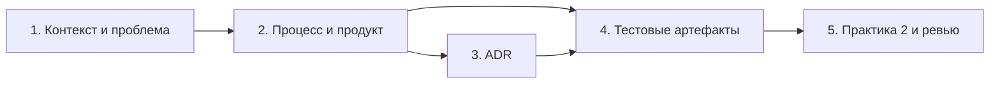

# План поставки

## Инкременты и ответственность

| Инкремент | Наблюдаемый результат | Что делает человек | Что делает AI или субагент | Проверка | Зависимости |
|---|---|---|---|---|---|
| 1. Контекст и проблема | Заполнены `context.md` и `problem.md`, факты отделены от допущений | Подтверждает пользователя, проблему, источники и метрики | Сопоставляет утверждения с `CASE.md` и `TRAINING_PR.diff`, отмечает неизвестные | Для каждой метрики есть способ замера и источник; `make -C practices/practice_01 test` проходит структурную проверку | `CASE.md`, `TRAINING_PR.diff` |
| 2. Процесс и продукт | Заполнены AS IS / TO BE, use case и acceptance criteria | Проверяет границы SCOPE-1 и выбирает вариант процесса | Формирует альтернативы и проверяемые сценарии | Диаграмма рендерится; шаги процесса связаны с SEC-1, API-1, REL-1, OUT-1, QA-1, OBS-1 | Инкремент 1 |
| 3. Архитектурное решение | ADR содержит решение, альтернативы, последствия и главный риск | Принимает решение и подтверждает неизвестные | Находит противоречия и неподтверждённые компоненты | ADR согласован с AS IS / TO BE и не расширяет полномочия сервиса | Инкремент 2 |
| 4. Тестовые артефакты | Unit, integration, load и E2E-планы имеют точные входы, результаты и evidence | Утверждает неизвестные параметры стенда и контракта ошибки | Проверяет полноту правил, границы и ссылки | Все семь релевантных правил покрыты; `make -C practices/practice_01 test` проходит | Инкременты 2–3 |
| 5. Практика 2 и ревью | Заполнены шесть `experiment.md`, журнал и замечания независимого ревью | Проверяет отклонённые предложения и принимает исправления | Выполняет разрешённые файловые проверки и сводит evidence | `make -C practices/practice_02 test` и `make step2` из корня проходят; ссылки открываются | Инкремент 4 |

## Диаграмма зависимостей

Календарные даты не зафиксированы: исходники не задают сроков и доступности участников. Инкременты выполняются в указанном порядке зависимостей; даты назначает человек.

## Контрольные точки и остановка

- После каждого инкремента проверить ссылки и структурную команду соответствующей практики.
- Остановиться и запросить решение человека, если нужен неподтверждённый контракт контролируемого ответа, параметры нагрузочного стенда, точка наблюдения логов или календарные сроки.
- Не менять исходный код сервиса, не выполнять approve/merge и не заявлять о прохождении функциональных тестов, которых в репозитории нет.

## Как использовали AI

- Для чего:
  - Итеративно проверить план поставки по доступным файлам, заменить шаблонные даты и непроверяемые формулировки наблюдаемыми результатами.
- Тип промпта:
  - ReAct с ограниченным набором read-only действий и лимитом шагов.
- Строка в [`../practice_02/prompts.md`](../practice_02/prompts.md):
  - ReAct.
- Что проверили и исправили сами:
  - Подтвердили команды по Makefile, сохранили роль человека в принятии решений и пометили отсутствующие сроки как неизвестные.
