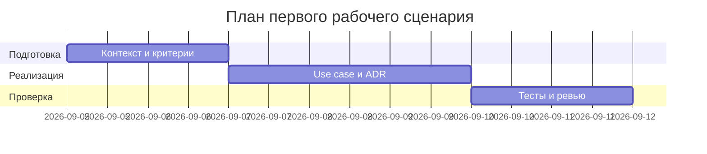

# План поставки

## Инкременты и ответственность

| Инкремент | Наблюдаемый результат | Что делает человек | Что делает AI или субагент | Проверка | Зависимости |
|---|---|---|---|---|---|
| 1 | Контекст и критерии собраны (context.md, problem.md) | Уточняет пользователя, проблему, метрики | Реформулирует материалы в мастер-промпт черновика | Ревью по CASE.md; запись P1-02 | CASE.md, TRAINING_PR.diff |
| 2 | Первый рабочий сценарий описан (use case, stories) | Проверяет границы SCOPE-1 | Генерирует сценарии и критерии под SEC-1, API-1, OUT-1 | Согласование с context.md/problem.md | Инкремент 1 |
| 3 | ADR и схема согласованы | Фиксирует решение и альтернативы | Предлагает минимальный дизайн под правила | Проверка связности с prompts.md | Инкремент 2 |
| 4 | Тестовый каркас: unit/integration/load/e2e | Выбирает покрытие и дополняет кейсы | Черновики тестов, привязка к правилам | Прогон make test (если есть) или ручная проверка | Инкременты 2-3 |

## Диаграмма Ганта

Замените даты и задачи на свой план.

## Как использовали AI

- Для чего:
  - Разбивка на минимальные инкременты, определение ролей человека и AI в подготовке артефактов.
- Тип промпта:
  - planning/master prompting.
- Строка в [`prompts.md`](prompts.md):
  - P1-03 (Заполнение SDLC).
- Что проверили и исправили сами:
  - Проверили зависимость каждого инкремента от контекста и правил; избегали обещаний реализации кода, ограничившись артефактами практики.
